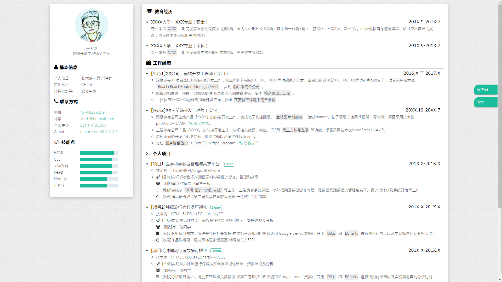

# 个人简历模板

项目来自于 https://gitee.com/itsay/resume.git

对原有项目的一些bug进行修复，并且补充了配置文档

http://shangyifly.fun:8080/

## 线上地址
http://shangyifly.fun:8080/

## Intro

欢迎提issue或者star，ღ( ´･ᴗ･` )比心

## Object

程序员求职

## Usage

1. 先Star/Fork本项目，然后Clone或者直接下载到本地
2. 修改index.html内相关信息
3. 微调样式
4. 部署到线上
5. 祝您求职成功！

## Preview

### PC端

### 移动端

## TODO
- [x] 左栏固定（切换）
- [ ] 输出pdf功能
- [ ] 可编辑

## ChangeLog
- 2017.3.7 创建模板
- 2017.3.12 移动端优化
- 2017.12.20 修改部分内容
- 2018.6.20 新增左栏固定功能（切换）

## Acknowledgments
- font-awesome提供字体图标

## LICENSE

MIT © [ITSAY](http://blog.if2er.com)
